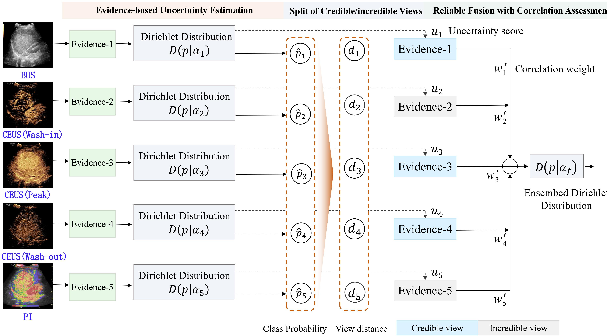

# CAMVF
This is the implementation code of the paper "Correlation-adaptive Multi-view CEUS Fusion for
Liver Cancer Diagnosis"


# Contents
- [Setup](#Setup)
- [Train](#Train)
	- [Environment Install](#Environment-Install)
   	- [Data Preparation](#Data-Preparation)
- [Parameter Search](#Parameter-Search)
- [Evaluate](#Train)


# Setup

## Environment Install
1. For conda environment:
```shell
conda env create -f environment.yml
```
2. For pip environment:
```shell
pip install -r requirements.txt
```
## Data Preparation
1. You need to have the image features in advance and organize the data into the following format
   - For a view with N-dimensional features, such as "con_view1.csv"
   
	| feature1 | feature2 | feature3 | ... | featureN |
	|----------|----------|----------|-----|----------|
	| value1   | value2   | value3   | ... | valueN   |
 	| ...      | ...      | ...      | ... | ...      |
	| value1   | value2   | value3   | ... | valueN   |

   - For all files, organize the data into the following format
	```shell
	data/
	|-- con_view1.csv
	|-- con_view2.csv
	|-- con_....csv
	|-- con_viewn.csv
	```
2. Edit the configuration file [config/train_config.py](config/train_config.py) to add your dataset information under data_set_config
The meaning of the data set configuration file is as follows:
```python
 'your_dataset_config_name': {
        'root': 'your_dataset_root_path',
        'classes': 'your dataset classes number',
        'dims': 'a list of the feature dimensions of each view',
        'name_list': 'A list of view names in the order corresponding to "dims"',
    }
```
# Train
You can run the training code with the following instructions
```python
python train.py --config {method}
```
{method} can be the following values:
- ecamvf: our method for paper "Correlation-adaptive Multi-view CEUS Fusion for Liver Cancer Diagnosis"
- camvf: our method for paper "Correlation-adaptive Multi-view CEUS Fusion for Liver Cancer Diagnosis"
- tmc
> Han, Z., Zhang, C., Fu, H., Zhou, J.T.: Trusted multi-view classification with
dynamic evidential fusion. IEEE Transactions on Pattern Analysis and Machine
Intelligence 45(2), 2551–2566 (2022)
- etmc
> Han, Z., Zhang, C., Fu, H., Zhou, J.T.: Trusted multi-view classification with dynamic evidential fusion. IEEE Transactions on Pattern Analysis and Machine Intelligence 45(2), 2551–2566 (2022)
- qmf
> Zhang, Q., Wu, H., Zhang, C., Hu, Q., Fu, H., Zhou, J.T., Peng, X.: Provable dynamic fusion for low-quality multimodal data. arXiv preprint arXiv:2306.02050(2023)
- gcca
> Afshin-Pour, B., Hossein-Zadeh, G.A., Strother, S.C., Soltanian-Zadeh, H.: Enhancing reproducibility of fmri statistical maps using generalized canonical correlation analysis in npairs framework. NeuroImage 60(4), 1970–1981 (2012)
- dcca
> Andrew, G., Arora, R., Bilmes, J., Livescu, K.: Deep canonical correlation analysis.
In: International Conference on Machine Learning. pp. 1247–1255. PMLR (2013)
- kcca
> Kuss, M., Graepel, T.: The geometry of kernel canonical correlation analysis (2003)
- dccae

# Parameter Search
We provide a hyperparameter search program on the data set, you can start a 5-fold cross-validation parameter search with the following command:
```shell
python optuna_train.py --config {method}
```
After the result is stable, you can modify the corresponding parameters in the configuration file
# Evaluate
After the training is completed, you can use the same configuration file  [config/train_config.py](config/train_config.py) to evaluate, and you can execute the following instructions to run the evaluation program:
```shell
python evaluate.py --config {method}
```
